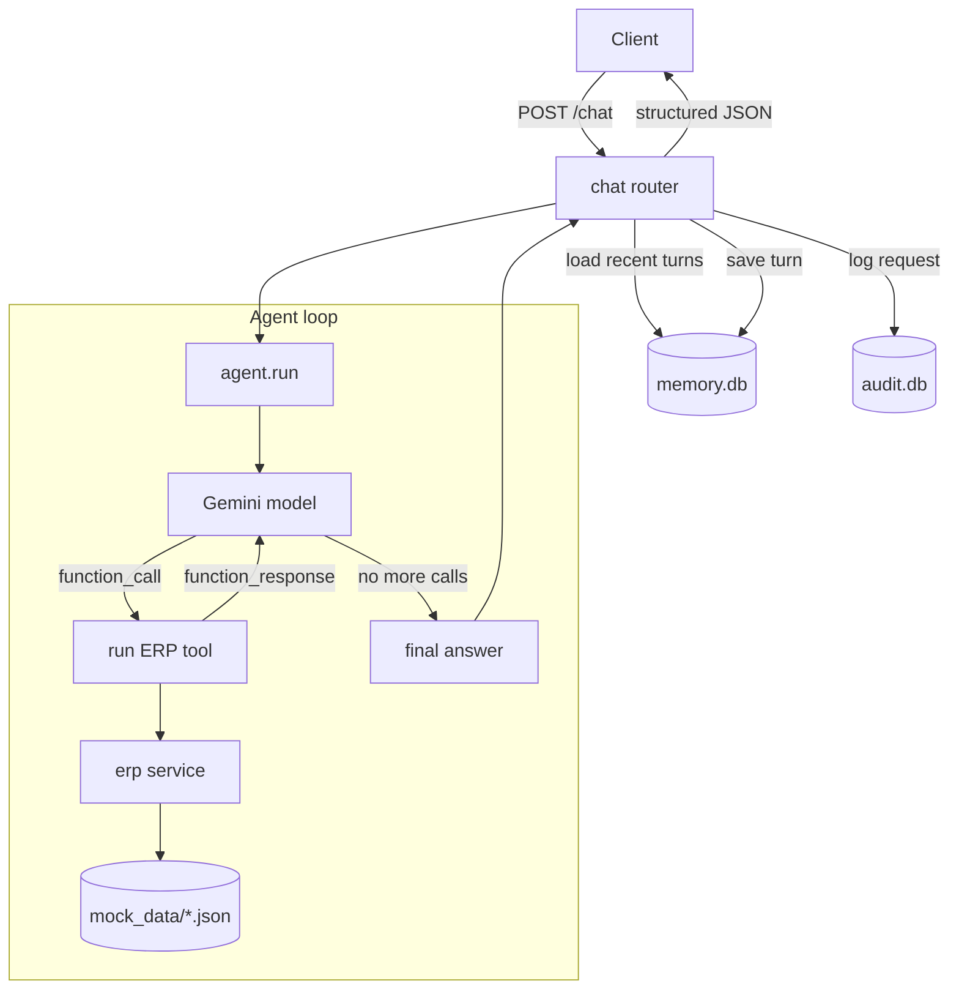

# Architecture

## Overview

The assistant is a thin FastAPI service wrapped around a single agent loop. Gemini
does the reasoning (intent + which tools + final wording); the app owns the data,
the tool execution, the memory and the guardrails.

## Request flow

1. **Validate** — blank messages are rejected (`400`); an unknown `student_id` is
   caught when the agent loads the student and returns `404`.
2. **Load context** — the last N turns for the `session_id` are pulled from memory and
   replayed into the model, so follow-up questions resolve without repetition.
3. **Plan + act** — the agent binds the subject student into a contextvar (so the model
   can't read another student's data) and starts the function-calling loop:
   - the model returns one or more `function_call` parts,
   - each is dispatched to the matching ERP tool,
   - results go back as `function_response` parts,
   - repeat until the model stops asking for tools or the step cap is hit.
4. **Compose** — the model's final text becomes `response`; the app derives `intent`,
   `status` and the `plan` from the tools that actually ran.
5. **Persist** — the turn is saved to memory and the request is written to the audit log
   (query, intent, tools, execution time, response, timestamp).

## Why these choices

- **Manual function calling** (not auto-mode) so the plan and `tools_used` are
  observable, and so the loop has a hard cap.
- **Student id bound server-side**, never a model argument — the tools only take query
  parameters (month, subject, day…), so the model cannot pull another student's record.
- **A pinned "today"** keeps day-relative answers ("tomorrow", "this month")
  deterministic for demos and tests.
- **SQLite for memory and audit** — zero setup, easy to inspect, matches the "JSON or
  SQLite" brief.

## Components

| Layer | File | Responsibility |
|-------|------|----------------|
| API | `app/api/chat.py` | endpoints, validation, timing, persistence |
| Agent | `app/agents/agent.py` | the reason → act → observe loop |
| Tools | `app/tools/registry.py` | model-facing tool declarations + dispatch |
| Data | `app/services/erp.py` | read + arithmetic over mock data |
| Model | `app/services/llm.py` | Gemini configuration |
| Memory | `app/memory/store.py` | conversation turns by session |
| Audit | `app/utils/audit.py` | per-request log |
